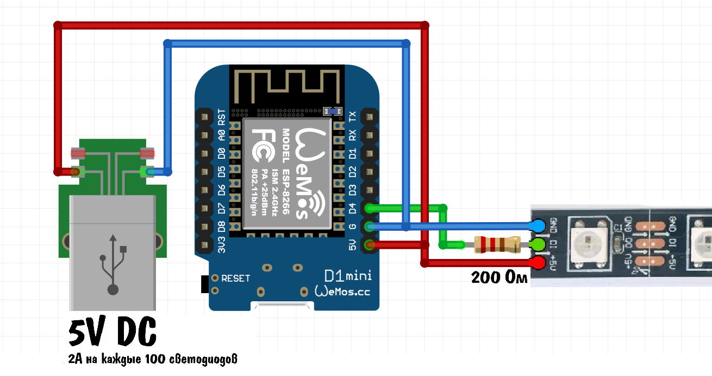

# ESP8266 LED Controller

Проект управления светодиодной лентой WS2812 через ESP8266 с веб-интерфейсом. На сайте, который генерирует микроконтроллер можно менять яркость и теплоту света ленты.

## src/secrets.h
```
// Замените значения на свои Wi-Fi данные
#define WIFI_SSID "your_ssid"
#define WIFI_PASS "your_password"
```
## Схема сборки

